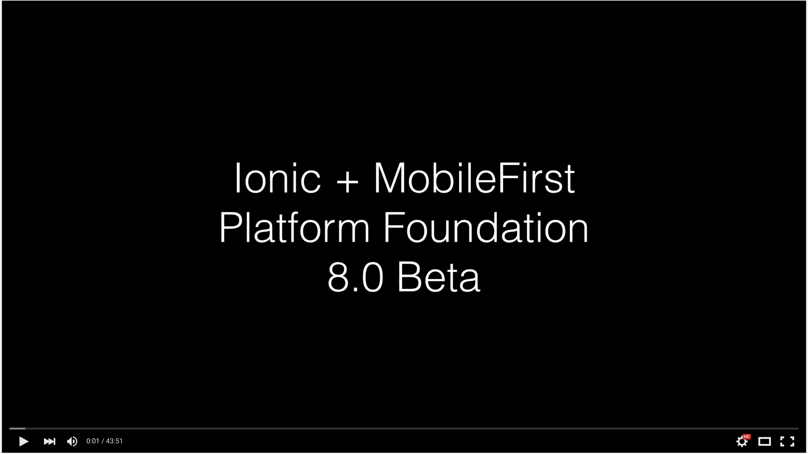

##Ionic + MobileFirst Platform Foundation 8.0 (MFP8)

### TLDR; Demo Video:
[](https://www.youtube.com/watch?v=DlxZYxXszIw)

### Setup a MobileFirst Platform Foundation 8 server 

- The easiest way to get a server running is using IBM Bluemix, there is a **Free** tier you can use
- Go to the IBM Bluemix Catalog and create a [Mobile Foundation Service](https://new-console.ng.bluemix.net/catalog/services/mobile-foundation/)

### Install Tools

- Setup the Command Lines Tools:

```bash
$ npm install -g mfpdev-cli  ionic@1.x cordova gulp-cli bower ios-deploy
$ android --help
$ adb version
$ javac -version (1.7+)
$ xcodebuild --help
```

### How to use the sample code

- Use Cordova CLI Template to download
- Use a unique App ID, App Name, App Path `cordova create PATH ID NAME --template TEMPLATE`
- App unique App ID is very important for Push Notifications setup

```bash
$ cordova create mfp8-app com.example.myapp Demo  --template https://github.com/csantanapr/mfp8-ionic-demo.git
```

- Change directory and **npm install**

```bash
$ cd mfp8-app/
$ npm install
$ rm -rf .git/
```

or in one single command (Linux, Mac)

```bash
$ APP=mfp8-app; cordova create ${APP} com.example.myapp Demo --template https://github.com/csantanapr/mfp8-ionic-demo.git && cd ${APP} && npm install && rm -rf .git/
````
### How to use the Ionic CLI

- Use `ionic` cli to add additional platforms and optional plugins
- Sample App already defines in config.xml most of the plugins from the demo, they get installed when you add the platform

```bash
$ ionic platform add ios@latest
$ ionic platform add android@latest
```
_Note_ : If having problems with Android check platforms/android/AndroidManifest.xml that the `<application>` elements contains the attribute `android:name="com.ibm.MFPApplication"` if not present add the attribute

- Use `ionic` cli to emulate and run

```bash
$ ionic emulate ios --livereload
$ ionic run  android --livereload
```
Ignore if the emulate prints something about missing ios-sim, Latest cordova-ios@4.x includes ios-sim

- Use `ionic` cli for other cordova actions

```bash
$ ionic prepare
$ ionic build
```

### How to use the MFPDev CLI

- Get help documentation for any MFPDev CLI `command`

```bash
$ mfpdev help [<command>]
$ mfpdev help
$ mfpdev help app preview
$ mfpdev help app config
...
```

- Add a server profile `bluemix` for a remote server using the real values from IBM Bluemix

```bash
$ mfpdev server add bluemix --url http://mobilefoundation-2u-server.mybluemix.net:80 --login admin --password ***** --setdefault
```

- If you have a mfp server running on localhost verify with the CLI

```bash
$ mfpdev server info
```

- Register the mobile App with a server

```bash
$ mfpdev app register local
$ mfpdev app register bluemix
```

- Switch back and forth the default server for the App

```bash
$ mfpdev app config server local 
$ mfpdev app config server bluemix
```

- Always propagate changes for mfp configuration from config.xml after register or config

```bash
$ ionic prepare 
```

- Live-Reload Preview using MobileFirst Browser Simulator (Cordova Emulation) or Simple Browser

```bash
$ mfpdev app preview
$ mfpdev app preview ios
$ mfpdev app preview ios android
```

- **Pull** down the App configuration from the local server and **Push** it up to the remote server

```bash
$ mfpdev app pull local
$ mfpdev app push bluemix
```

- To update web resources for after releasing the App to the App Store or corporate environment

```bash
$ mfpdev app webupdate bluemix
```


### License
Apache 2.0

